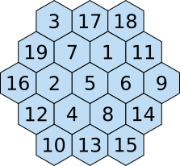
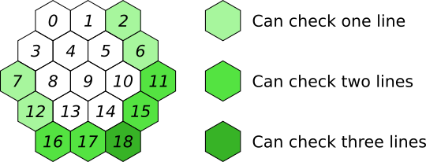
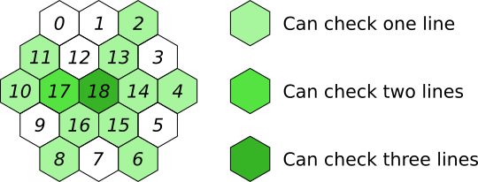
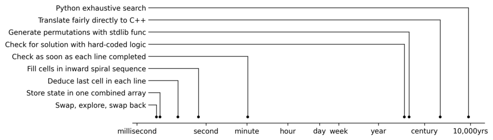

# Motivation

One of my children came home from school a little while ago having
been set the challenge of filling in a magic hexagon.  You have to put
the numbers from 1 up to 19 into the cells such that each of the 15
lines (of varying length, between 3 and 5 cells long) add up to the
same answer.

It turns out that is not _too_ hard to work out the solution by hand,
as in [this transcript of a 1964
article](https://www.math.uni-bielefeld.de/~sillke/PUZZLES/magic-hexagon-trigg).
There is also a [Wikipedia
article](https://en.wikipedia.org/wiki/Magic_hexagon) about the
problem.  The unique (up to rotation and reflection) solution is:

Even though we already know the answer, I thought it might be
interesting to see how we could we search for this solution.

All speeds, times and factors in this write-up are rounded to one or
two significant figures.  A suffix "k" means thousand, and a suffix
"M" means million.

# Unthinking exhaustive search

We can first observe that the sum of all cells is 190, which is also
the sum of the five horizontal lines.  Since those horizontal lines
all have the same sum, every line must sum to 190÷5=38.  So our
searches will check that every line adds up to 38.

It is easy enough to write a nice recursive exhaustive search,
checking once every cell is filled in whether the board is a solution
to the problem.

## Python

A first attempt would involve [writing this in Python](solve-hex.py).  It sat
there in silence for what seemed like a long time, not producing any
solutions.

Adding some timing code revealed that this code can evaluate 500k
permutations per second.  Knowing how fast it runs, we can ask whether
getting the solutions this way is feasible.  Since 19! is about
1017, it would take a bit over 8,000 years to test all
permutations.  It's not surprising that I didn't immediately see the
answers fly up the screen.

## C++

We might try moving to C++.  A fairly direct translation of the Python
code can test 8M permutations per second, a speed-up factor of 17.
Now we'd only be waiting about 500 years for the program to run to
completion.

This and all following algorithms are implemented in the same [C++
program](solve-hex.cpp).  You choose which one to run by giving a command-line
argument.  Some variants are run a number of times, to allow better
timing measurement.

The argument for this first attempt, the simple translation of the
Python code, is `manual-perm-vec-vecs-check`, for reasons to be
explained shortly.

# Implementation tweaks

The current code tests whether a hexagon is magic by referring to a
collection of vectors of cell indices, where each vector describes one
of the fifteen lines.  We might be suspicious that this is slow, and
replace the is-it-a-solution function with a hard-coded list of calls
to one of a set of is-sum-correct functions depending on how many
cells are in each line.  This made essentially no difference to the
speed.  (Algorithm name `manual-perm-hardcoded-check`.)

This is not the first time that somebody has needed to iterate over
all permutations of a collection.  Instead of our manual recursive
permutation logic, we can use the C++ standard library function
`next_permutation()`, and use just one array, rearranging it every
time with a call to `next_permutation()`.  This is considerably
simpler and faster, testing about 180M permutations per second with
the vector-of-vectors test code (algorithm name
`stdlib-perm-vec-vecs-check`), or 290M permutations per second with
the hard-coded test code (`stdlib-perm-hardcoded-check`), a factor of
35 quicker.  This brings the run time to completely explore the space
down to only 14 years.

This code would efficiently parallelise, which might, on say a 32-core
machine, bring us down to a few months.

But instead of just trying to make the existing logic run more
quickly, we can try to be more intelligent about how we look for
possible solutions.

# Early stopping

We can abandon a partially-filled attempt early, if we know we're not
going to be able to complete it successfully.  Each time we fill in
the last cell of a line, we can check whether that line has the
required sum of 38.  If not, we do not need to explore all the ways to
finish filling in the hexagon.  Sometimes we complete more than one
line when we fill in a particular cell, in which case we check all
just-completed lines.  This figure shows the cells where we can check
at least one new line, giving up early if we don't get a sum of 38.
The numbers _0_ up to _18_ show the order in which we fill in the
cells.

In total, we check all fifteen lines.

To work this way, we do have to go back to manual recursion rather
than using `next_permutation()`, since we are no longer testing all
permutations.

This finally gives a program which has a feasible running time
(algorithm name `line-by-line-check`).  We get twelve results, which
is to be expected because we are not eliminating rotations or
reflection.  The program runs in 65s, a speed-up of a factor of about
7M.

The first result is the one given at the top of this page.  We can
work out that this would be the 18,473,955,480,703,453rd permutation
to be tried by the unthinking brute-force code, so even the best
(non-parallelised) brute-force implementation would take just over two
years to produce any output.

# Improved exploration order

So far we've been trying to fill in the cells top to bottom, left to
right (this is sometimes known as "raster order").  By choosing a
different order, we can check more line conditions earlier, and
abandon the partial candidate if the line does not sum to 38.  An
inwards spiral order seemed quite promising:

This (algorithm name `line-by-line-check-spiral`) produces all
solutions in 470ms, a speed-up of a factor of 140 over the raster
order.  With this change, we have to interpret the output differently,
since the values are printed in spiral order not raster order,
although we do of course get the same set of solutions.

# Deduce rather than search

In the above code, when we're filling in the last cell of a line, we
go through each available number, fill in the cell with that value,
then test whether the sum is 38.  We can instead work out what number
has to go in that cell to make the sum 38, and look for that number in
our list of available numbers.  If it's there, then we use it and
carry on.  If not, we need not explore further.  For cells where there
is more than one line we could use to deduce the needed number (the
cells with index 17 and 18 — see the figure), we use an arbitrary
line, and then do a final check of all lines at the end before
concluding that we really do have a solution.

We keep the spiral order in this approach (algorithm name `deduce`).
The run time comes down to 60ms, an improvement by a factor of 8.

## Implementation tweaks

We're storing the state of our exploration in two lists: one
representing the board as filled in so far, and another holding the
numbers which have not yet been used and so are still available.
Exploring involves moving numbers from one list to the other.  We can
simplify the design by having just one fixed-size array with 19 slots.
We swap elements around within this array, so that after filling in
the first, say, five cells (in our spiral order), the first five
elements of the array hold the numbers in those cells, and the
remaining fourteen elements of the array hold the "available" numbers.
This (algorithm name `deduce-array`) gets us down to 10ms, another
factor of 6 faster.

Every time we tentatively fill in a cell and explore from there, we're
copying the array, so as to not forget the previous state of the
board.  We can instead swap the array elements, do the exploration,
and then swap the elements back again.  This gives a relatively modest
improvement in speed, down to 7ms, a speed-up of only 30% (algorithm
name `deduce-array-swap`).

# Evolution of run time

We can see the different stages of improvement in speed of the search
on this **log-scale** graph:

# Call it a day

I tried a few other code-level tweaks but none of them helped:

* Keep a bitmap saying which numbers are available, to save searching.
  If the number is available, the code does then have to search to be
  able to do the swap.  This turns out to slow it down a bit.

* Sometimes the "needed number" is less than 1 or greater than 19,
  which is impossible.  We can check for this situation first, and
  save searching at all.  This too turns out to slow it down a bit.

* I briefly played with generating special-case code for each case of
  "how many numbers are available".  This might have helped slightly
  but the results weren't clear.

At this point I decided that this exercise had reached the point of
diminishing returns.  The total speed improvement from the first
Python version to the best C++ version was 8,000 years down to 7ms, an
overall speed gain of 4×1013.

# Comparison with 1964 paper

The 1964 Trigg paper mentions that a Honeywell 800 computer had
"analyzed 196729 configurations in 3 minutes, 20 seconds" to confirm
the uniqueness of the solution.  This suggests there is scope for
further pushing the trade-off between human thought and computer time.

# Future work

There are some code-level tweaks I didn't try, such as

* Working out how to compare more than one number at once, using SSE
  or similar instructions.

* Working out a shorter sequence of swaps which still explores every
  available number while leaving the array in its initial state
  afterwards.

And some non-code avenues for further investigation:

* It would be nice to know whether there is a better order than the
  inwards spiral in which to perform this mixture of choosing and
  deducing the cell values.

* Is that 1963 program for the Honeywell 800 recorded anywhere?
